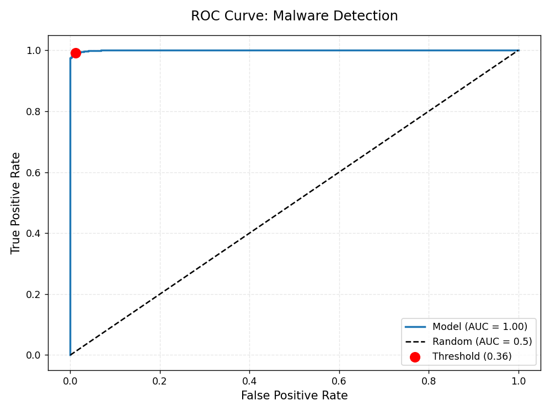

# ExeRay 2.0 :hospital:   
<p align="center">
  
</p>

*Advanced X-ray Vision for Windows Executables*    

- Detect malicious `.exe` files using machine learning. Extracts **static features (entropy, imports, metadata) and combines ML with heuristic rules for fast, automated classification.**  

---

## 🚀 What's New in v2.0
- **50+ New Detection Features** (VM detection, anti-debugging, API call chains)
- **Enhanced Prediction Engine** with detailed suspicious behavior reports if malware found
- **Recall-Optimized Training**: Custom scorer prioritizing malware detection
- **Streamlined 3-Script Architecture** (faster workflow)
- **Improved Accuracy** (F1-score up to 0.99 in testing)
- **Dataset Provided !!**

## 📊 Dataset Information

**- Source & Composition**:

<div align="center">

<table>
  <thead>
    <tr>
      <th>Dataset</th>
      <th>From</th>
      <th>Examples</th>
      <th>Total</th>
    </tr>
  </thead>
  <tbody>
    <tr>
      <td><strong>Malicious Dataset</strong></td>
      <td>
        <a href="https://github.com/iosifache/DikeDataset">DikeDataset</a>, 
        <a href="https://github.com/ytisf/theZoo">theZoo</a>, 
        <a href="https://bazaar.abuse.ch/">MalwareBazaar</a>
      </td>
      <td>WannaCry.exe, njRAT.exe</td>
      <td>10,925</td>
    </tr>
    <tr>
      <td><strong>Benign Dataset</strong></td>
      <td>
        Windows Files, 
        <a href="https://ninite.com/">Ninite.com</a>, 
        <a href="https://portableapps.com/">PortableApps.com</a>
      </td>
      <td>Putty.exe, notepad.exe, ida.exe</td>
      <td>3,590</td>
    </tr>
    <tr>
      <td colspan="3" style="text-align:right;"><strong>Total</strong></td>
      <td><strong>14,515</strong></td>
    </tr>
    <tr>
      <td colspan="3" style="text-align:right;"><strong>Size</strong></td>
      <td><strong>11.81 GB</strong></td>
    </tr>
  </tbody>
</table>

</div>

- **Dataset Processing:** From **10,925 malware samples,** we processed **4,200 for feature extraction,** then applied **Undersampling to balance with 3,500 benign samples (7,000 total)**. Used **RandomUnderSampler (random_state=42)** to **prevent malware bias while preserving key patterns.**
- Benign and Malicious Dataset Link **(11.81 GB on MEGA)**: https://mega.nz/folder/iAU3iARQ#nKPwCQIW4jZgAEFmRJlR6Q
- **⚠️ Safety Notice:**
  - Please exercise caution when downloading and handling this dataset. It contains both benign and malicious files for research purposes.
  - Do not execute or open any files unless you're in a secure, isolated environment (e.g., a virtual machine or sandbox). Executing malicious files can harm your system or compromise your data.
- **⚠️ Important Notice About the Dataset:**
  - To keep this repository lightweight and easy to download, the full dataset is not included here. Specifically:
    - The **data/** folder does not contain any executable files.
    - You will find only two empty directories: **benign/** and **malware/**.
    - If you wish to work with the actual dataset, you need to download it manually from the **MEGA link.**
<p align="center">
  <a href="https://mega.nz/folder/iAU3iARQ#nKPwCQIW4jZgAEFmRJlR6Q" target="_blank">
    
  </a>
</p>

## :gear: **Enhanced Features**  
- Hybrid AI detection **(XGBoost + Random Forest)**
- **Detailed Malware Fingerprinting**:
  - VM/Sandbox detection markers
  - Anti-debugging technique identification
  - Suspicious API call patterns
- **Confidence Scoring** with threat level classification  

## :wrench: Upgraded Tech Stack
### **New Components:**
- **Advanced PE Analysis**: Full directory parsing (TLS, Debug, Resources)
- **String Analysis**: Unicode/ASCII pattern detection
- **Behavioral Indicators**: 15+ new malware behavior signatures

### **Key Improvements:**
#### **- Structural Features:**
```bash
# PE File Structure
'num_sections', 
'num_unique_sections',
'section_names_entropy',
'avg_section_size',
'min_section_size',
'max_section_size',
'total_section_size',
'avg_entropy',
'min_entropy',
'max_entropy',
'has_packed_sections',
'has_executable_sections',
'writable_executable_sections',
'is_dll',
'is_executable',
'is_system_file',
'has_aslr',
'has_dep',
'is_signed',
'has_rich_header',
'rich_header_entries',
'has_resources',
'num_resources',
'has_embedded_exe',
'has_debug',
'has_tls',
'has_relocations',
'ep_in_first_section',
'ep_in_last_section',
'ep_section_entropy',
'has_suspicious_sections'
```
#### **- Behavioral Features:**
```bash
# API/Import Analysis
'num_imports',
'num_unique_dlls',
'num_unique_imports',
'imports_to_dlls_ratio',
'has_import_name_mismatches',
'suspicious_imports_count',
'num_exports',
'suspicious_exports',
'suspicious_api_chains',
'has_delayed_imports',
'has_vm_detection_imports',
'has_anti_debug_imports',
'has_process_creation_imports',
'has_createprocess',
'has_setwindowshookex',

# String Patterns
'num_strings',
'avg_string_length',
'has_suspicious_strings',
'has_anti_debug',
'has_vm_detection_strings',
'has_vm_mac_addresses',
'has_anti_debug_strings',
'has_nop_sleds',
'has_anti_debug_strings'
```

#### **- Detection Signatures:**
```bash
vm_detection_strings = {
    b'vbox', b'vmware', b'virtualbox', b'qemu', b'xen', b'hypervisor',
    b'virtual machine', b'vmcheck', b'vboxguest', b'vboxsf', b'vboxvideo'
}

vm_mac_prefixes = {
    b'00:0C:29', b'00:1C:14', b'00:05:69', b'00:50:56',  # VMware
    b'08:00:27',  # VirtualBox
    b'00:16:3E',  # Xen
    b'00:1C:42',  # Parallels
    b'00:15:5D'   # Hyper-V
}

anti_debug_strings = {
    b'IsDebuggerPresent', b'CheckRemoteDebuggerPresent', b'OutputDebugString',
    b'NtQueryInformationProcess', b'NtSetInformationThread', b'ZwSetInformationThread'
}

suspicious_patterns = {
    b'payload', b'malware', b'inject', b'virus', b'trojan',
    b'backdoor', b'rat', b'worm', b'spyware', b'keylog',
    b'xored', b'encrypted', b'packed', b'obfus'
}

# API Groups
vm_detection_apis = {
    'cpuid', 'hypervisor', 'vmcheck', 'vbox', 'vmware', 'virtualbox',
    'wine_get_unix_file_name', 'wine_get_dos_file_name'
}

anti_debug_apis = {
    'IsDebuggerPresent', 'CheckRemoteDebuggerPresent', 'OutputDebugStringA',
    'NtQueryInformationProcess', 'NtSetInformationThread', 'NtQuerySystemInformation',
    'GetTickCount', 'QueryPerformanceCounter', 'RDTSC', 'GetProcessHeap',
    'ZwSetInformationThread', 'DbgBreakPoint', 'DbgUiRemoteBreakin'
}

process_creation_apis = {
    'CreateProcessA', 'CreateProcessW', 'CreateProcessAsUserA', 'CreateProcessAsUserW',
    'SetWindowsHookExA', 'SetWindowsHookExW', 'ShellExecuteA', 'ShellExecuteW',
    'WinExec', 'System'
}

# Suspicious API Chains
api_sequences = {
    ('VirtualAlloc', 'WriteProcessMemory', 'CreateRemoteThread'): 'Process Injection',
    ('RegCreateKey', 'RegSetValue', 'RegCloseKey'): 'Registry Persistence',
    ('LoadLibraryA', 'GetProcAddress', 'VirtualProtect'): 'Dynamic API Resolution',
    ('OpenProcess', 'ReadProcessMemory', 'WriteProcessMemory'): 'Process Hollowing',
    ('NtUnmapViewOfSection', 'MapViewOfFile', 'ResumeThread'): 'RunPE Technique',
    ('CreateProcessA', 'WriteProcessMemory', 'ResumeThread'): 'Process Injection',
    ('SetWindowsHookExA', 'GetMessage', 'DispatchMessage'): 'Hook Injection'
}
```

## :file_folder: **Directory Structure**  
```plaintext
ExeShield_AI/
├── assets/                      # Repo Images
├── data/                        # Raw Samples  
│   ├── malware/                 # Malicious Executables  
│   └── benign/                  # Clean Executables
├── dependencies/                # Installation Dependencies
├── models/                      # Saved Models/Thresholds  
│   ├── malware_detector.joblib  
│   └── optimal_threshold.npy  
├── output/                      # Processed Data (CSV/features)
│   └── processed_features_dataset.csv
├── scripts/                     # Core Scripts  
│   ├── extract_features.py  
│   ├── train_model.py  
│   └── predict.py  
└── README.md
```

## :computer: Installation and Usage (Commands & Outputs)

### **1. Clone the repository:**
```bash
git clone https://github.com/MohamedMostafa010/ExeRay.git
cd ExeRay
```
### **2. Install dependencies:**
```bash
pip install -r dependencies/requirements.txt
```
### **3. Extract Features:**
```bash
> python extract_features.py
[*] Processing benign samples from ../data\benign...
[!] Not a valid PE file: adaminstall.exe
[!] Not a valid PE file: adamsync.exe
[!] Not a valid PE file: AddSuggestedFoldersToLibraryDialog.exe
[!] Not a valid PE file: AgentService.exe
[!] Not a valid PE file: AggregatorHost.exe
[!] Not a valid PE file: appcmd.exe
[!] Not a valid PE file: AppHostRegistrationVerifier.exe
[!] Not a valid PE file: ApplySettingsTemplateCatalog.exe
[!] Not a valid PE file: ApplyTrustOffline.exe
[!] Not a valid PE file: ApproveChildRequest.exe
[!] Not a valid PE file: AppVClient.exe
[!] Not a valid PE file: ARPPRODUCTICON.exe
[!] Not a valid PE file: audit.exe
[!] Not a valid PE file: AuditShD.exe
[!] Not a valid PE file: autofstx.exe
...
[*] Processing malware samples (limited to 3500) from ../data\malware...

[+] Processed Features Dataset saved to ../output/processed_features_dataset.csv
[+] Total samples: 6857
[+] Malware samples: 3500
[+] Benign samples: 3357

```
### **4. Train Model (Metrics Also Provided After Training to Know Your Model's Performance):**
```bash
> python train_model.py
Training models:   0%|                                                                                                                                                 | 0/2 [00:00<?, ?it/s]
New best model: XGBoost (Recall=0.990)
Training models: 100%|█████████████████████████████████████████████████████████████████████████████████████████████████████████████████████████████████████████| 2/2 [00:07<00:00,  3.90s/it]

=== Evaluation ===
              precision    recall  f1-score   support

           0       0.99      0.99      0.99       672
           1       0.99      0.99      0.99       700

    accuracy                           0.99      1372
   macro avg       0.99      0.99      0.99      1372
weighted avg       0.99      0.99      0.99      1372

ROC AUC: 1.000

Model saved to ../models/malware_detector.joblib
``` 
### **5. Predict Executable:**
```bash
> python predict.py "path/to/[benign_file]"
Malware Detection Results:
========================================
File: CapCut.exe
Prediction: BENIGN
Malware Probability: 0.41%
Confidence Level: VERY_LOW
Decision Threshold: 35.93%

> python predict.py "path/to/[suspicious_file]"
Malware Detection Results:
========================================
Malware Detection Results:
========================================
File: Mh1.exe
Prediction: MALWARE
Malware Probability: 98.39%
Confidence Level: VERY_HIGH
Decision Threshold: 35.93%

Top Suspicious Features:
- High maximum section entropy: 7.887
- Suspicious API imports: 6
- High average section entropy: 5.743
- High section name entropy: 2.807
- Writable and executable sections: 2
- Suspicious API call chains: 1
- Anti-debugging API imports: 1
- Anti-debugging strings in code: 1
```

## :mag: Handling False Positives
- While ExeShield AI achieves high accuracy, occasional false positives (legitimate files flagged as malware) may occur. Common causes:
  - Legitimate tools with behaviors resembling malware (e.g., putty.exe).
  - Packed/obfuscated benign files (high entropy).
    
**- Example False Positive Output (Below is an example of a malicious file (1.exe) predicted as BENIGN:**
```bash
> python predict.py python predict.py "C:\Users\[USERNAME]\Documents\Maicious_TEST\1.exe"
Malware Detection Results:
========================================
File: 1.exe
Prediction: BENIGN
Malware Probability: 1.56%
Confidence Level: VERY_LOW
Decision Threshold: 35.93%
```
### Mitigation Strategies:
- **Adjust Threshold:**
  - Lower the decision threshold in predict.py for stricter filtering
- **Whitelist Trusted Files:**
  - Manually verify and exclude known-safe executables.
- **Retrain the Model:**
  - Add misclassified samples to your dataset and rerun train_model.py.

## 🤝 **ROC Curve Analysis**
<p align="center">
  
</p>

**Model Performance Metrics:**
- 🟦 **Our Model (AUC = 1.00)**: Perfect classification capability  
- 🟥 **Random Guess (AUC = 0.5)**: Baseline for comparison  
- 📊 **Optimal Threshold**: 36% (0.36 in probability units)  

**Key Interpretation:**
- **X-axis (False Positive Rate)**: Lower values = fewer false alarms  
- **Y-axis (True Positive Rate)**: Higher values = more malware caught  
- **Perfect Score**: Curve touching top-left corner (achieved in our case)

## 🤝 **Contributing**
- Pull requests are welcome! If you have ideas for new user profiles, simulation modes, or forensic artifacts, feel free to contribute.

## :book: **License**
- This project is released under the **MIT License**.
